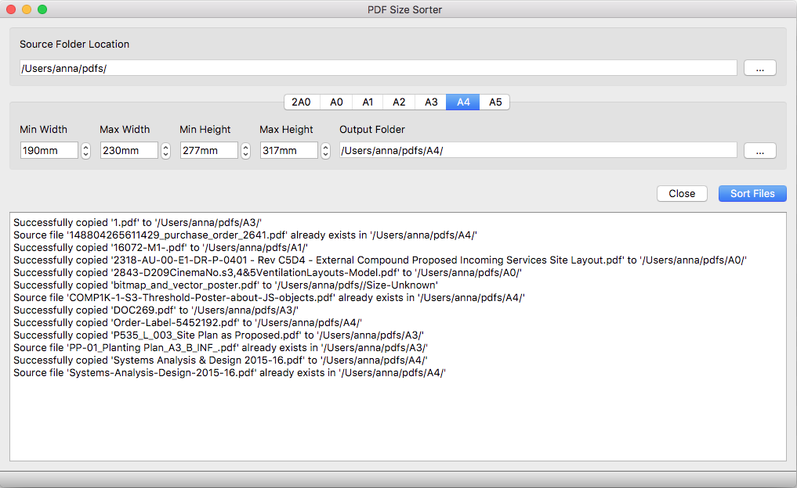

# PdfSizeSorter
Organises PDF files into various folders based on the physical size of their first page. Utilises Qt 5.15 for the UI and Poppler pdf library for reading pdf files.

This program was requested by a friend and implemented chiefly as a learning exercise.

## Compiling

### MacOS

* Install brew and then run `brew install poppler` (This will install the poppler-qt files too).

* Use the included PdfSizeSorter.pro file for Qt Creator.

### Windows

* Against best practice I have included all dependencies for Windows because they can be rather hard to find, especially the bins. They're contained in the poppler\_for\_win folder and are linked to from the included .pro file below.

* Use PdfSizeSorter_windows.pro file for Qt Creator.

## Screenshots

